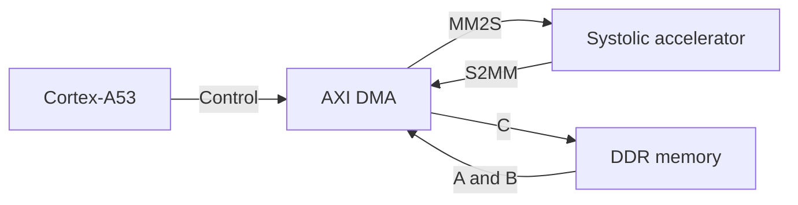

# AXI-Stream 8×8 Systolic Matrix Multiplier for the AUP-ZU3

This project implements an integer matrix-multiplication accelerator based on a two-dimensional systolic array. The accelerator was written in Verilog, packaged as a custom AXI4-Stream IP, and integrated with the Processing System of a RealDigital AUP-ZU3 board through an AXI Direct Memory Access (DMA) engine.

The validated configuration multiplies two signed 8-bit matrices of size \(8\times8\) and returns a signed 32-bit result matrix. A bare-metal application running on the ARM Cortex-A53 transfers the operands from DDR memory to the programmable logic, receives the result, computes a software reference, and compares every output element.

## TL;DR

- **Array:** \(8\times8\), with 64 multiply-accumulate Processing Elements (PEs).
- **Input:** two \(8\times8\) signed INT8 matrices.
- **Output:** one \(8\times8\) signed INT32 matrix.
- **Architecture:** output-stationary systolic array.
- **Interface:** 128-bit AXI4-Stream input and output.
- **Data movement:** AXI DMA in simple, polling mode.
- **Target:** RealDigital AUP-ZU3, `xczu3eg-sfvc784-2-e`.
- **Tools:** AMD Vivado and Vitis 2025.2.1.
- **Status:** RTL simulation, synthesis, implementation, XSA export, and on-board functional validation completed.

Detailed documentation is organized by component:

- [RTL architecture and implementation](rtl/README.md)
- [RTL simulation](tb/README.md)
- [Vitis on-board validation](vitis/README.md)
- [Vivado hardware integration](hardware/README.md)

## System overview

The Cortex-A53 prepares matrices \(A\) and \(B\) in DDR memory. The DMA memory-to-stream channel (MM2S) sends both matrices to the accelerator. After the multiplication is complete, the stream-to-memory channel (S2MM) writes matrix \(C\) back to DDR, where it is checked against a CPU implementation.



### Validated configuration

| Property | Value |
|---|---:|
| Matrix dimension | \(8\times8\) |
| Input element | Signed 8-bit integer |
| Accumulator/output element | Signed 32-bit integer |
| Processing Elements | 64 |
| AXI4-Stream width | 128 bits |
| Input transfer | 128 bytes / 8 beats |
| Output transfer | 256 bytes / 16 beats |
| PL clock | 100 MHz nominal |
| Matrix layout | Row-major |

The RTL exposes parameters for the matrix dimension and data width, but the configuration documented and tested in hardware is `N = 8`, `DATA_WIDTH = 8`, and `AXIS_WIDTH = 128`.

## Design outline

Matrix multiplication is defined as

\[
C_{ij}=\sum_{k=0}^{N-1} A_{ik}B_{kj}.
\]

The implementation uses an output-stationary dataflow: every PE is associated with one element \(C_{ij}\) and retains its partial sum locally. Elements of matrix \(A\) propagate horizontally through the array, while elements of matrix \(B\) propagate vertically. The inputs are skewed in time so that the pair \(A_{ik},B_{kj}\) reaches PE \((i,j)\) during the same clock cycle.

The accelerator is divided into four RTL modules:

| Module | Responsibility |
|---|---|
| `mac_pe.v` | Signed multiplication, local accumulation, and operand forwarding. |
| `systolicArray.v` | Instantiation and interconnection of the \(N\times N\) PE grid. |
| `matrix_scheduler.v` | Matrix capture, input skewing, array control, and completion signaling. |
| `axis_Systolic.v` | AXI4-Stream reception, computation sequencing, and result transmission. |

The scheduler follows four states: `IDLE`, `CLEAR`, `RUN`, and `DONE`. The array is cleared before each multiplication and is stepped for

\[
3N-2
\]

cycles. For the validated \(8\times8\) configuration, this corresponds to 22 `RUN` cycles.

The AXI wrapper follows the sequence `RECEIVE → START → COMPUTE → SEND`. It accepts data only while receiving a new problem, starts the scheduler after all input beats have arrived, and advances its output counter only after a valid AXI transfer. `M_AXIS_TLAST` is asserted with the sixteenth result beat. The current interface does not use `TKEEP`.

### Stream data layout

The MM2S transfer contains the two input matrices consecutively:

```text
TX buffer (128 bytes): [ A: 64 × INT8 ][ B: 64 × INT8 ]
RX buffer (256 bytes): [ C: 64 × INT32 ]
```

All matrices are flattened in row-major order. Therefore, element \((i,j)\) is stored at index `i*N + j`.

## Verification outline

### RTL simulation

The scheduler testbench packs signed matrices into the flattened RTL buses, calculates the expected product, waits for `o_valid`, and compares all 64 output elements. It also checks the `o_busy` handshake, verifies that `o_valid` lasts one cycle, and confirms that the scheduler returns to `IDLE`. The current directed cases include an identity multiplication and a dense signed multiplication.

### On-board validation with Vitis

The bare-metal validation application performs the following sequence:

1. Configure the AXI DMA in simple mode and disable DMA interrupts.
2. Generate matrices \(A\) and \(B\) in an aligned transmit buffer.
3. Compute \(C=A\times B\) on the Cortex-A53 using signed 32-bit accumulation.
4. Flush the transmit buffer from the data cache.
5. Arm the S2MM channel before starting MM2S, so the receiver is ready before the accelerator produces output.
6. Poll both DMA channels with a timeout.
7. Invalidate the receive-buffer cache range.
8. Compare every FPGA result against the CPU reference.

The following functional cases were used:

| Test | Expected property |
|---|---|
| Identity | \(I B = B\) |
| Zero matrix | \(0B = 0\) |
| All ones | Every output element equals 8 |
| Signed values | Positive, negative, and zero operands |
| Extreme values | Operands include `-128` and `127` |
| Pseudorandom | 1000 reproducible matrix pairs using a fixed seed |

The comparison is exact: no numerical tolerance is required because both implementations operate on integers.

## Repository structure

```text
.
├── rtl/       Verilog accelerator modules and implementation notes
├── tb/        RTL testbenches and simulation notes
├── vitis/     Bare-metal validation application
├── hardware/  Exported hardware description and integration notes
├── reports/   Selected synthesis and implementation reports
└── images/    Architecture diagrams, waveforms, and block-design captures
```

This version includes the exported hardware needed by Vitis, but it does not yet provide an automated Tcl flow for rebuilding the complete Vivado project.

## Current limitations and further work

- Only the \(8\times8\) configuration has been validated on the AUP-ZU3.
- The design processes one matrix pair at a time.
- DMA operation uses polling rather than interrupts.
- Communication and computation are not overlapped.
- The AXI4-Stream interface does not include `TKEEP`.
- Latency and sustained-throughput measurements have not yet been automated.

Planned experiments include separating DMA and accelerator latency, measuring sustained throughput under repeated requests, comparing the accelerator with the Cortex-A53 and desktop CPUs, and evaluating different matrix dimensions and buffering strategies.

## Acknowledgments

The organization and explanatory style of this documentation were inspired by the [2D Systolic Array Multiplier](https://github.com/tms4517/2D-Systolic-Array-Multiplier) project.
