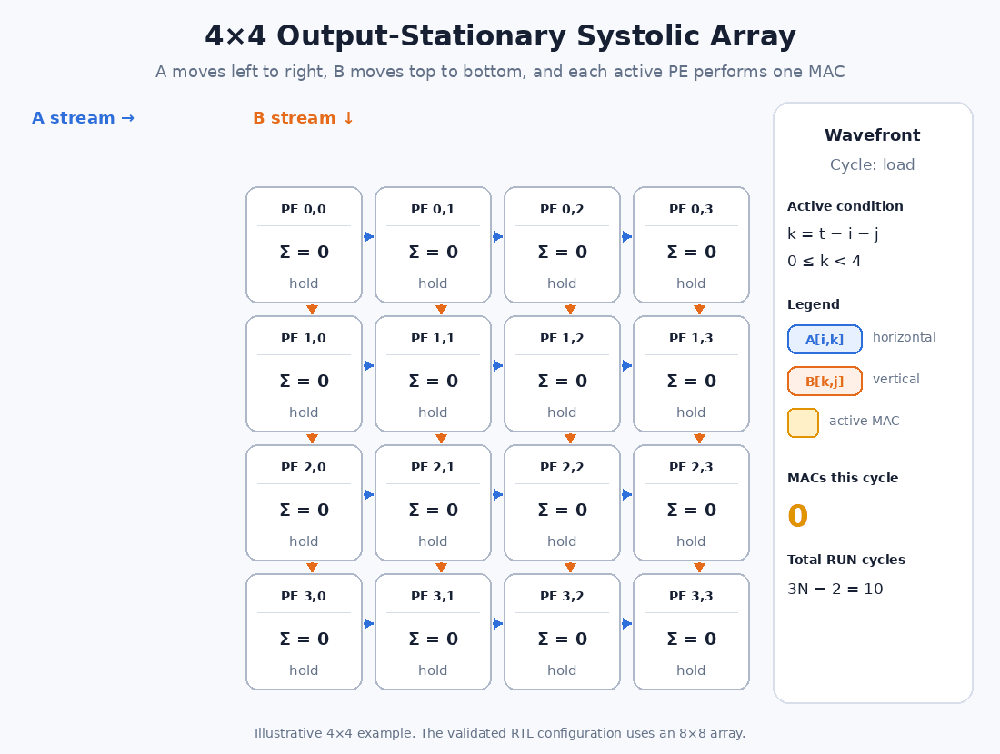
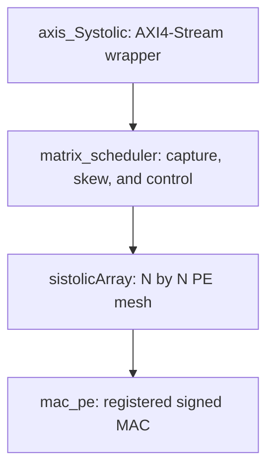

# RTL Architecture

This directory contains the Verilog implementation of the matrix-multiplication accelerator. The design is organized as four layers: an AXI4-Stream wrapper, a matrix scheduler, an $N\times N$ systolic mesh, and the multiply-accumulate processing element used at every mesh position.

The configuration validated in simulation and on the AUP-ZU3 uses an $8\times8$ array, signed 8-bit operands, signed 32-bit accumulators, and a 128-bit AXI4-Stream interface.



> The animation uses a 4×4 array to keep the wavefront readable. The implemented and validated hardware configuration is 8×8.

## Module hierarchy



| Source file | Verilog module | Responsibility |
|---|---|---|
| [`axis_Systolic.v`](axis_Systolic.v) | `axis_Systolic` | Receives both operands over AXI4-Stream, starts the computation, and streams the result. |
| [`matrix_scheduler.v`](matrix_scheduler.v) | `matrix_scheduler` | Captures the matrices, clears the array, skews the input wavefront, and reports completion. |
| [`systolicArray.v`](systolicArray.v) | `sistolicArray` | Instantiates and connects the $N^2$ processing elements. |
| [`mac_pe.v`](mac_pe.v) | `mac_pe` | Multiplies two signed operands, accumulates locally, and forwards the operands to adjacent PEs. |

The spelling difference between the file `systolicArray.v` and its module name `sistolicArray` is intentional in the current source and must be preserved when instantiating it.

## Dataflow

For matrix multiplication,

$$
C_{ij}=\sum_{k=0}^{N-1} A_{ik}B_{kj}.
$$

The design uses an **output-stationary** dataflow. PE $(i,j)$ owns the partial sum for $C_{ij}$ for the duration of an operation. Values from $A$ move horizontally from left to right, values from $B$ move vertically from top to bottom, and the accumulator does not leave the PE until the complete result bus is read.

The scheduler delays each row and column according to its index. At scheduler cycle $t$, it injects

$$
A_{i,k}\ \text{into row }i\quad\text{and}\quad B_{k,j}\ \text{into column }j
$$

when $t=i+k$ for row $i$ and $t=j+k$ for column $j$. After propagation through the registered mesh, the matching pair reaches PE $(i,j)$ at

$$
t=i+j+k.
$$

This skew creates a diagonal wavefront of active PEs and guarantees that both operands participating in the same product arrive together.

## Processing element

`mac_pe` is a registered signed multiply-accumulate unit. Its state consists of a local accumulator and two forwarding registers.

On every rising clock edge:

- `i_rst = 1` synchronously clears the accumulator and both forwarding registers.
- `i_step = 1` adds `i_a * i_b` to the accumulator and forwards `i_a` and `i_b` through `a_o` and `b_o`.
- `i_step = 0` holds all three registers.

Conceptually, the update is

$$
\operatorname{acc}_{t+1}=\operatorname{acc}_{t}+\operatorname{signed}(a_t)\operatorname{signed}(b_t).
$$

For the validated 8-bit configuration, the product is 16 bits and the accumulator is 32 bits. The theoretical range of an 8-term signed INT8 dot product is $[-130048,131072]$, so 32 bits provide ample headroom.

## Systolic mesh

`sistolicArray` creates the two-dimensional PE grid with nested `generate` loops.

- `rowInput[i]` feeds the left edge of row $i$.
- Each PE forwards its registered $A$ operand to the next column.
- `ColInput[j]` feeds the top edge of column $j$.
- Each PE forwards its registered $B$ operand to the next row.
- The accumulator of PE $(i,j)$ is placed in result slice `i*N + j`.

The flattened output is therefore row-major:

```text
result[(i*N + j)*ACC_WIDTH +: ACC_WIDTH] = C[i][j]
```

The mesh has no global reduction tree. All $N^2$ dot products progress concurrently, while the registered links provide the temporal alignment required by the wavefront.

## Matrix scheduler

`matrix_scheduler` converts two complete flattened matrices into the skewed row and column streams consumed by the mesh.

### Scheduler states

| State | Action | Transition |
|---|---|---|
| `STATE_IDLE` | Wait for `i_start`; capture `i_matrix_a` and `i_matrix_b`. | `i_start` → `STATE_CLEAR` |
| `STATE_CLEAR` | Assert the array reset for one clock, clearing all PE state. | Unconditional → `STATE_RUN` |
| `STATE_RUN` | Assert `i_step`, inject skewed operands, and advance `cycle_q`. | Last cycle → `STATE_DONE` |
| `STATE_DONE` | Assert `o_valid` for one clock. | Unconditional → `STATE_IDLE` |

`o_busy` is high in every state except `STATE_IDLE`. A new request must therefore be issued only when `o_busy` is low.

### Run length

The first useful product enters PE $(0,0)$ at cycle 0. The final product reaches PE $(N-1,N-1)$ at cycle

$$
(N-1)+(N-1)+(N-1)=3N-3.
$$

Because cycle numbering starts at zero, the required number of `RUN` cycles is

$$
\texttt{MULT\_CYCLES}=3N-2.
$$

For $N=8$, the array runs for 22 cycles (`cycle_q = 0` through `21`). The scheduler adds one `STATE_CLEAR` cycle before those 22 cycles and exposes `o_valid` during the following `STATE_DONE` cycle.

## AXI4-Stream wrapper

`axis_Systolic` adapts the fixed-size matrix operation to AXI4-Stream. It uses the same `axis_clk` for the AXI interface and the compute core, so no clock-domain crossing is present inside the custom IP.

### Wrapper states

| State | AXI behavior | Internal behavior |
|---|---|---|
| `STATE_RECEIVE` | `S_axis_ready = 1` while reset is released. | Store each accepted input beat. |
| `STATE_START` | Input is backpressured; output remains invalid. | Pulse `scheduler_start` for one clock. |
| `STATE_COMPUTE` | Both stream directions are idle. | Wait for the scheduler's `finish` pulse. |
| `STATE_SEND` | `M_axis_valid = 1`; assert `M_axis_last` on the final beat. | Advance only on `M_axis_valid && M_axis_ready`. |

The output counter changes only after a completed AXI handshake. Consequently, `M_axis_data` and `M_axis_last` remain stable while the downstream receiver applies backpressure.

The current framing is based on fixed beat counts:

- `S_axis_last` is present at the port but is not inspected by the RTL.
- The wrapper accepts exactly `INPUT_BEATS` before starting the scheduler.
- `M_axis_last` is generated from the output beat counter.
- `TKEEP` is not implemented.

### Validated stream layout

With `N = 8`, `ELEMENT_WIDTH = 8`, and `AXIS_WIDTH = 128`:

| Transfer | Payload | Size | AXI beats |
|---|---:|---:|---:|
| MM2S input | Matrix $A$, then matrix $B$ | 128 bytes | 8 |
| S2MM output | Matrix $C$ | 256 bytes | 16 |

The wrapper writes beat 0 into the least-significant 128 bits of its input buffer, then fills progressively higher slices. The lower 512 bits hold $A$ and the upper 512 bits hold $B$:

```text
Input buffer:  [ B: 64 × INT8 ][ A: 64 × INT8 ]
Bit position:       high              low
```

Within each matrix, element $(i,j)$ occupies flattened index `i*N + j`. Each output beat contains four consecutive 32-bit results; beat $q$ carries flattened elements $C[4q]$ through $C[4q+3]$.

## Reset and transaction sequence

`axis_aresetn` is active low and sampled synchronously on `axis_clk`. The wrapper converts it to the scheduler's active-high synchronous reset.

A complete request follows this sequence:

1. Release `axis_aresetn`.
2. Transfer all eight input beats while `S_axis_ready` is asserted.
3. The wrapper pulses `scheduler_start` in `STATE_START`.
4. The scheduler captures the matrices, clears the PE mesh, and executes the 22-cycle wavefront.
5. The wrapper enters `STATE_SEND` after the scheduler asserts `o_valid`.
6. Transfer all 16 result beats; the last accepted beat has `M_axis_last = 1`.
7. Return to `STATE_RECEIVE`, ready for the next matrix pair.

## Parameterization constraints

The source exposes `N`, operand width, and AXI width parameters, but the current implementation is fully validated only for:

```text
N             = 8
ELEMENT_WIDTH = 8
AXIS_WIDTH    = 128
```

Changing parameters requires care:

- `mac_pe.y_o` and `matrix_scheduler.o_matrix_c` are fixed at 32 bits per result, so operand widths other than 8 are not currently generic end to end.
- `INPUT_BITS` and `RESULT_BITS` must be exactly divisible by `AXIS_WIDTH`; partial final beats are unsupported because there is no `TKEEP`.
- Counter widths derived with `$clog2` must remain nonzero for the selected beat counts.
- The software buffer sizes and DMA transfer lengths must match the generated stream sizes.

## Verification boundary

The scheduler-level testbench is located at [`../tb/scheduler_tb.v`](../tb/scheduler_tb.v). It checks an identity multiplication and a dense signed multiplication, compares all output elements, verifies `o_busy`, confirms that `o_valid` lasts exactly one cycle, and starts a second operation without applying another global reset.

On-board validation additionally covers zero matrices, all-ones matrices, mixed signed values, INT8 extremes, and 1000 reproducible pseudorandom matrix pairs. See the [project overview](../README.md) and the Vitis documentation for the software-side flow.

## Current architectural limitations

- One matrix pair is processed at a time.
- Input reception, computation, and output transmission do not overlap.
- Complete operand matrices are buffered before computation begins.
- The fixed-length input frame ignores `S_axis_last`.
- The AXI4-Stream ports omit `TKEEP`.
- The compute core and AXI wrapper share one clock domain.
